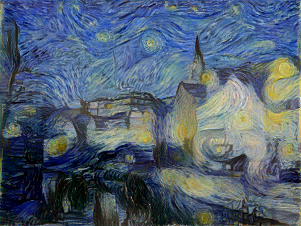

# Style Transfer (Tensorflow Implementation)

An implementation of [Image Style Transfer Using Convolutional Neural Networks](https://www.cv-foundation.org/openaccess/content_cvpr_2016/papers/Gatys_Image_Style_Transfer_CVPR_2016_paper.pdf) in tensorflow.

Requirements:
* Tensorflow
* numpy, scipy
* [VGG19 model](http://www.vlfeat.org/matconvnet/models/imagenet-vgg-verydeep-19.mat)

A demo file `style_transfer_demo.py` is provided.

## Sample Images
Settings:
* alpha = 1.0
* beta = 1.0
* num_iter = 1000

Tested on Win10 and Ubuntu 16.04
